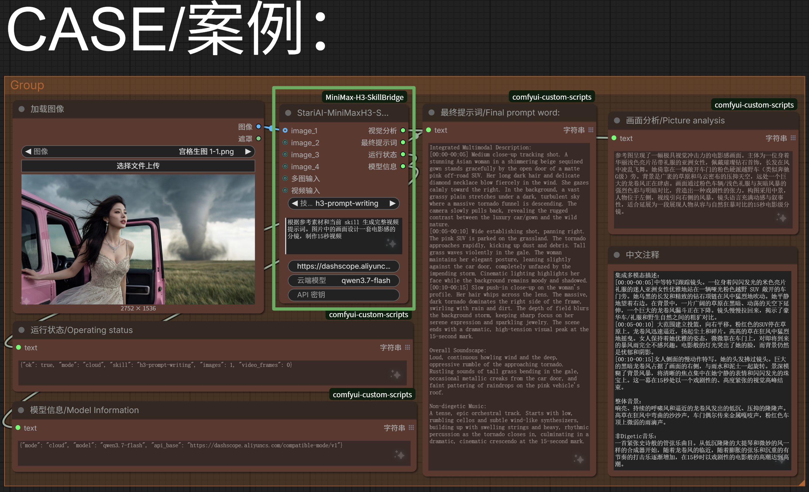

# ComfyUI-MiniMax-H3-SkillBridge

> **作者：StarAI** | ID: `StariAI`

ComfyUI 节点：结合本地 `SKILL.md` 规则（含 MiniMax H3 视频技能）、图片/视频参考和用户要求，调用 OpenAI 兼容的云端视觉模型生成视频提示词。

## 关于作者

- **StarAi 官网**：[https://staraigc.top](https://staraigc.top)
- **Bilibili**：[https://space.bilibili.com/495356821](https://space.bilibili.com/495356821)
- **YouTube**：[https://www.youtube.com/@StarAIGC](https://www.youtube.com/@StarAIGC)
- **QQ群**：[https://qm.qq.com/q/lge501JeLY](https://qm.qq.com/q/lge501JeLY)

## 示例




## 特性

- 自动发现本地 `SKILL.md`，把技能规则注入系统提示词
- 内置 MiniMax H3 视频 prompt 写作技能，开箱即用
- `image_1` 至 `image_6` 动态图片输入，初始显示 1 个，连接后自动增加下一个
- 支持 `images` 批次输入与 `video` 视频帧输入
- 调用 OpenAI 兼容的 Chat Completions 接口（支持视觉参数）
- 输出分为「视觉分析」和「最终视频提示词」两段
- 支持 5-15 秒视频时长和 0-15 次切镜控制
- `holographic-explainer` 自动把长文案按 H3 上下文窗口串行生成；用户只使用现有 Skill 或 Chat 节点，不需要添加 T8 节点
- 连续段使用进程内、SHA-256 校验的 H3 AV tail，云端自动链路不生成也不依赖 `clip_*.safetensors`
- 末段自动把普通分段 MP4 流式合成为一个最终 MP4，并保留可审计的无 latent 链路清单

## 安装

把 `ComfyUI-MiniMax-H3-SkillBridge` 目录放到 ComfyUI 的 `custom_nodes` 下，开启依赖：

```bash
pip install -r requirements.txt
```

重启 ComfyUI 后，在节点搜索框输入 `StariAI-MiniMaxH3-Skill` 或 `StariAI-MiniMaxH3-Chat`。

## 多轮对话节点

插件内置 `StariAI-MiniMaxH3-Chat`，用于先对话调整视频提示词，确认后再放行下游视频工作流。

### 推荐工作流

```text
参考图/视频 → StariAI-MiniMaxH3-Chat → 下游文本节点 → 视频生成节点
```

1. 将 `运行模式` 设置为 `多轮对话`。
2. 在 `用户要求` 中填写第一轮创作要求，点击节点内的 `发送本轮对话`。
3. 查看节点中的对话结果；需要修改时，直接改写 `用户要求`，再次点击 `发送本轮对话`。
4. 对话阶段只执行当前对话节点，不会运行下游视频节点。
5. 满意后点击 `确认并生成`，节点会输出 `最终提示词`，并提交完整工作流生成视频。
6. `清空对话` 会清除当前节点的历史和确认状态。

也可以使用顶部的运行按钮：多轮对话模式下，普通运行只执行对话节点；确认后才会执行完整工作流。对话历史会保存在节点的会话状态中，随工作流保存。

## 全息讲解长视频自动续写

选择 `holographic-explainer` 后，SkillBridge 会要求云端模型生成可验证的分段计划。只要计划含有两段或更多段，点击一次运行即可启动串行生成：

1. 第 1 段按照当前工作流生成。
2. 只有最终 H3 AV sampler 和视频合并节点都成功完成后，SkillBridge 才截取上一段的 22 帧视频与匹配音频 latent tail，并排入第 2 段。
3. 后续段会自动使用对应计划 prompt，不会重新调用云端文案模型，也不会重复 Chat 的确认流程。
4. 每段的重复上下文会从视频和音频同时裁掉；最后一个片段完成后自动合成最终 MP4，停止排队。

当前工作流保持原有的 Ref2VA、双采样与视频合并节点。插件在运行时注入私有节点，不显示在画布上，也不要求安装或连接 `comfyui-minimax-h3-audio-T8`。

由于 H3 在续写时需要 22 帧上下文，首段交付时长最多 15 秒，后续段最大交付时长为约 14.167 秒。分段计划会据此验证并拒绝会被错误裁切的时长。

### 云端上下文规则

- 上下文仅保留上一段最小必要 AV tail，先 `detach`、转 CPU、连续化，再由 SHA-256 校验。
- 状态只公开链 ID、段次、计划 hash、上下文 hash 与进度；不会把 latent、完整文案、参考 tensor 或 API key 写入工作流和状态文件。
- 自动链路不会创建 `clip_00001.safetensors`、`*.context.safetensors` 或其他用于续写的 latent 文件。每段正常生成的视频文件仍会按工作流的输出设置保留；最终文件位于 `output/SkillBridge-H3/<chain_id>/H3_Sequential_*_final.mp4`。
- 链路目录只保存普通 MP4 和 `chain.json` 审计清单（段号、视频 SHA-256、计划 hash、最终视频 hash）；不会写入提示词、API key、参考 tensor、`h3ctx://` 句柄或 latent。
- ComfyUI 进程重启或云端 worker 迁移后，内存上下文会明确变成 `需要恢复`（`detached`）。插件不会扫描输出目录、不会取最新 safetensors 或普通视频猜测上下文继续生成；请从已完成视频重新启动新的链。
- 自动续写点击一次运行即串行完成，节点内不再提供手动暂停 / 继续 / 取消控制，也不需要放置额外控制节点。

### 多轮对话输出

- `视觉分析`：当前轮的参考素材分析
- `当前结果`：当前轮生成的提示词
- `最终提示词`：确认后输出，可连接到文本节点或视频生成节点
- `对话历史`：当前节点的文本历史
- `运行状态`：模式、轮数和确认状态
- `模型信息`：当前 API 地址和模型

`一次性输出` 模式与原有节点类似，运行一次直接输出提示词，不进入对话状态。

## 视频时长与切镜

- `视频时长（秒）`：可选择 5-15 秒，提示词时间线必须完整覆盖所选时长。
- `不切镜`：一镜到底，只生成一个连续镜头，视频中不发生镜头切换。
- `自动`：根据用户描述、参考素材和视频时长自动判断合理的切镜数量。
- `切镜1` 到 `切镜15`：表示镜头切换次数，不是镜头段数量。例如 `切镜1` 会生成 2 个镜头段，`切镜3` 会生成 4 个镜头段。

固定切镜时，模型必须输出连续、不重叠、不留空白的时间线，并准确执行指定的切换次数。多轮对话中如果修改了时长或切镜数量，请先点击 `继续对话` 重新生成，确认满意后再点击 `确认并生成`。

## 使用

节点参数：

| 参数 | 说明 |
| --- | --- |
| `skill` | 使用的 `SKILL.md` 技能名 |
| `user_prompt` | 用户要求 |
| `api_base` | OpenAI 兼容接口地址，例如 `https://api.openai.com/v1` |
| `model` | 服务商实际的视觉模型名 |

## API Key 配置

节点内置 **「API 密钥」** 输入框，实现一次性、不泄露的密钥输入：

- 输入后显示为 **密码（••••）**，不会明文显示。
- 该输入框设置 `serialize = false`，**不会写入工作流 JSON**，因此分享工作流文件/截图都不会泄露密钥。
- 每次重新加载工作流或刷新页面后需**重新输入**（一次性输入设计）。
- 输入框为空时，自动回退读取环境变量 `SKILLBRIDGE_API_KEY` 或插件目录 `.env` 中的密钥。

```powershell
# 可选：环境变量方式（Windows PowerShell）
$env:SKILLBRIDGE_API_KEY="your_api_key_here"
```

```bash
# 可选：插件目录 .env 方式（复制 .env.example 后填写）
SKILLBRIDGE_API_KEY=your_api_key_here
```

> 节点「API 密钥」输入框的值只存在于当前会话内存，运行时随 API 请求发送，**不落盘、不进工作流**。`.env` 已被 `.gitignore` 排除，不会提交。

图片输入：

```text
Load Image → image_1
Load Image → image_2
Image Batch → images
```

初始只显示 1 个直接图片接口；连接当前最后一个接口后会自动增加下一个，最多 6 个。需要更多图片时请使用 `images` 批次接口。`video` 接收视频帧序列，按固定 8 帧、间隔 1 帧采样。

系统代理默认不继承；如需代理请自行在代码中配置，本节点不内置代理参数。

## Skill

节点扫描插件内置的 `skills/` 目录，把每个 `SKILL.md` 作为一条技能规则，在 `skill` 下拉框中列出。

内置技能：

- `3d-animation-short-generator`：3D 动画短片工作流
- `brand-promo-video-generator`：品牌宣传短片
- `co-op-game-intro-generator`：双人合作游戏开场动画
- `h3-prompt-writing`：MiniMax H3 视频提示词写作
- `handdrawn-live-video-generator`：手绘发光动画与实拍融合
- `minimalist-product-ad-generator`：极简产品广告片
- `mv-subtitle-skill-confirmed`：音乐 MV 与歌词字幕
- `paper-collage-explainer-generator`：纸质拼贴科普动画
- `papercraft-stop-motion-explainer`：纸艺定格科普视频

## 输出

- `analysis`：视觉分析
- `result`：最终视频提示词
- `status`：执行状态 JSON
- `model_info`：模型信息 JSON
- `分段提示词JSON`：仅在 `holographic-explainer` 返回有效计划时提供；由内部自动续写运行时消费，不需要手动接线

多轮节点的输出名称为：`视觉分析`、`当前结果`、`最终提示词`、`对话历史`、`运行状态`、`模型信息`、`分段提示词JSON`。

## 依赖

- `requests`
- `Pillow`
- `numpy`
- `av`（最终 MP4 合成；多数 ComfyUI 环境已自带）

## License

[MIT](./LICENSE)
